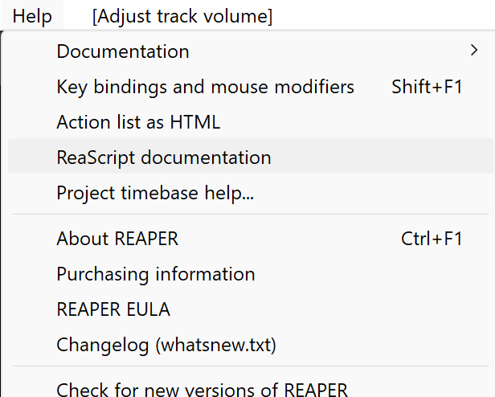

# reascript2hx

A small library that extracts the ReaScript Lua documentation using `reascriptluaparser` and generates Haxe externs. 

**This is not a full solution it's simply a helper tool for a quicker start rather than manually created each HAxe extern.**

You need to provide the `reascripthelp.html` which can be generated by Reaper itself as seen in the image below.

