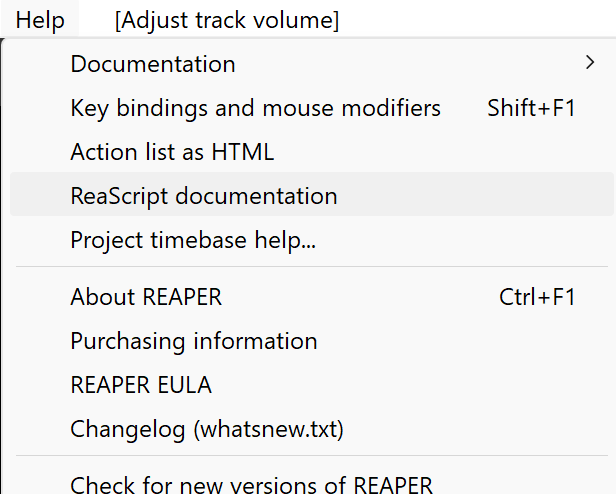

# reascript2hx

A small library that extracts the ReaScript Lua documentation using [reascriptluaparser](https://github.com/Claudiohbsantos/reascriptluaparser) and generates Haxe externs. 

**This is not a full solution it's simply a helper tool for a quicker start rather than manually creating each Haxe extern.**

You need to provide the `reascripthelp.html` which can be generated by Reaper itself as seen in the image below.

